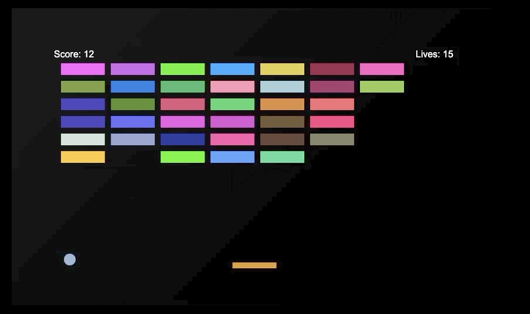

# Brick Breaker

## Objetivo

En BrickBreaker, el objetivo es romper todos los ladrillos en la pantalla usando una bola y una paleta. El jugador controla la paleta para evitar que la bola caiga fuera de la pantalla, reflejando la bola hacia los ladrillos para romperlos.

## Gameplay

El jugador controla una paleta en la parte inferior de la pantalla utilizando el ratón. Al comienzo del juego, el jugador tendrá que sacar la pelota haciendo clic con el botón izquierdo del ratón. El jugador puede dirigir la pelota haciendo que rebote en diferentes puntos de la paleta. Si la pelota choca con el centro de la paleta, rebotará hacia arriba. Cuanto más cerca del borde de la paleta toque la pelota, más ángulo tendrá la desviación. Los ladrillos solo necesitan un golpe para ser destruidos. Después de destruir todos los ladrillos de la pantalla, el jugador pasará al siguiente nivel.

## Potenciadores

Al destruir un ladrillo, existe la posibilidad de que deje caer un potenciador generado aleatoriamente que ayudará o dificultará al jugador.

 **Vida Extra:** Al recogerla, este potenciador aumenta las vidas del jugador en 1

 **Menos Vida:** Al recogerlo, este potenciador reduce las vidas del jugador en 1

 **Acelerar:** Al recogerlo, este potenciador aumenta la velocidad de la pelota

 **Ralentizar:**  Al recogerse, este potenciador reduce la velocidad de la pelota

 **Nueva bola:** Al recogerse, este potenciador añade una bola más al juego.

### Carpetas

##### bin/ - Contiene los ejecutables del proyecto
##### src/ - Contiene el codigo fuente
##### include/ - Los archivos de cabecera 
##### assets/ - Contiene los recuros del proyecto
##### docs/ - Contiene la documentacion del proyecto

## Complementos necesarios en Visual Studio Code

##### - Material Icon
##### - C/C++
##### - PlantUML
##### - GitGraph
